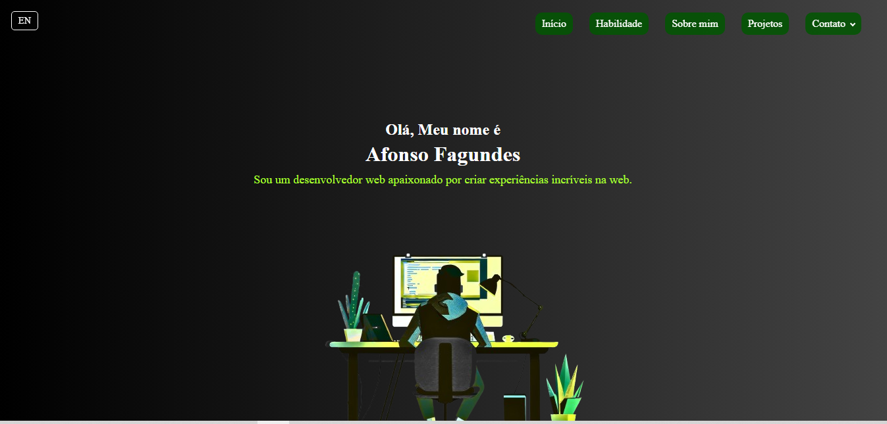

# 💼 Portfólio - Afonso Fagundes

🚧 **Este projeto está em desenvolvimento** (branch: `feature2`)  
Será publicado na `main` quando estiver concluído.

---

## ✨ Sobre

Este é meu portfólio pessoal como desenvolvedor Front-End. O objetivo é apresentar minhas habilidades técnicas, projetos realizados e canais de contato profissional de forma moderna e responsiva.

---

## 🚧 Status do Projeto

- ⚙️ Desenvolvimento ativo na branch `feature2`
- 🧪 Novas seções e melhorias sendo implementadas
- 🧹 Código e layout ainda em fase de refinamento
- 🚀 Deploy final será feito após merge com a `main`

---

## ⚙️ Tecnologias utilizadas

- HTML5
- CSS3
- JavaScript
---

## 🖼️ Demonstração



---

```md
# Clone este repositório
git clone https://github.com/afonsofagundes/Portfolio.git

# Acesse a branch em desenvolvimento
cd Portfolio
git checkout feature2

# Abra o index.html no navegador


